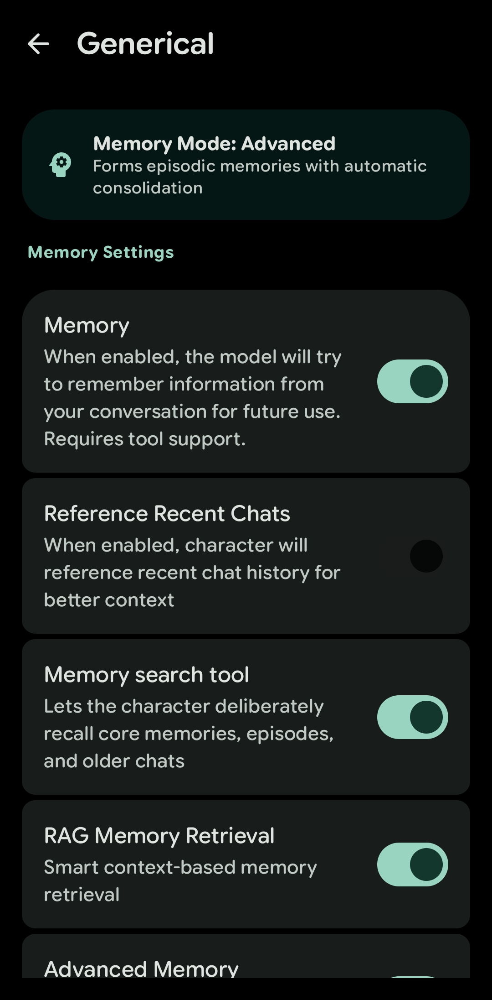
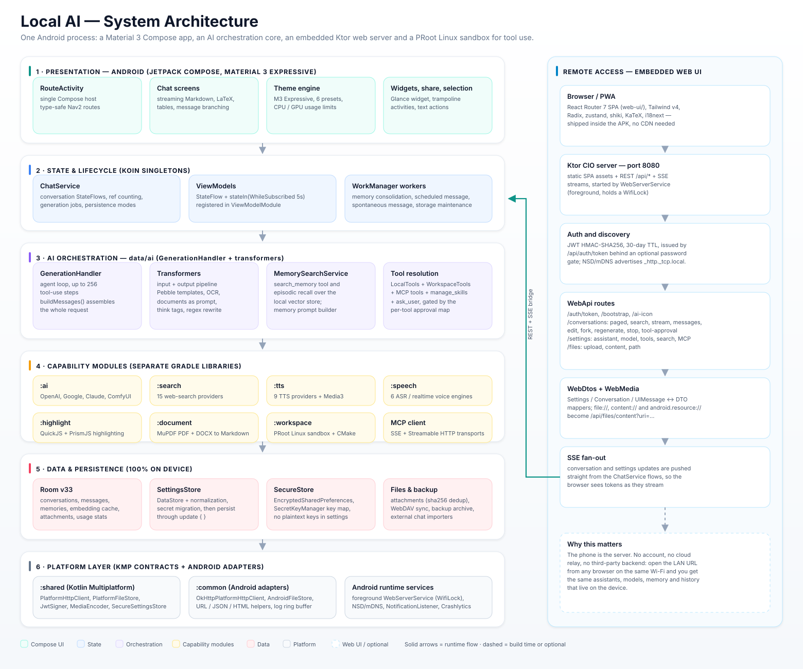
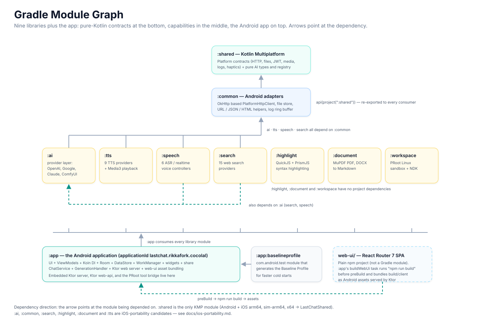
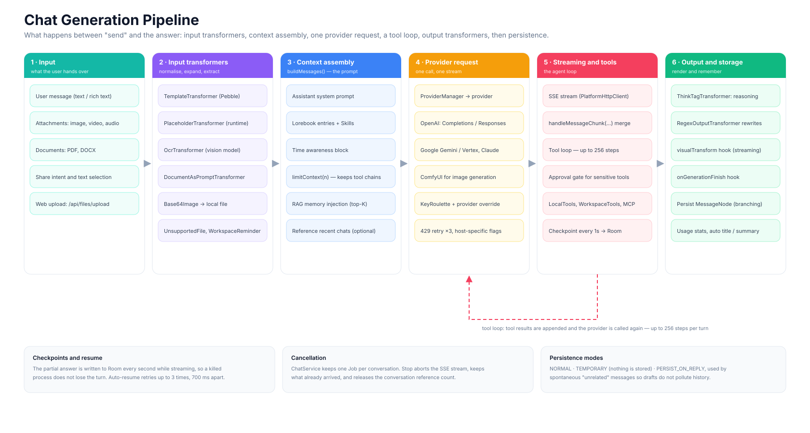
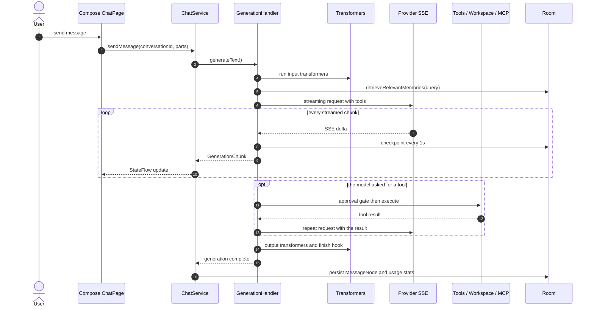
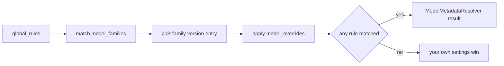
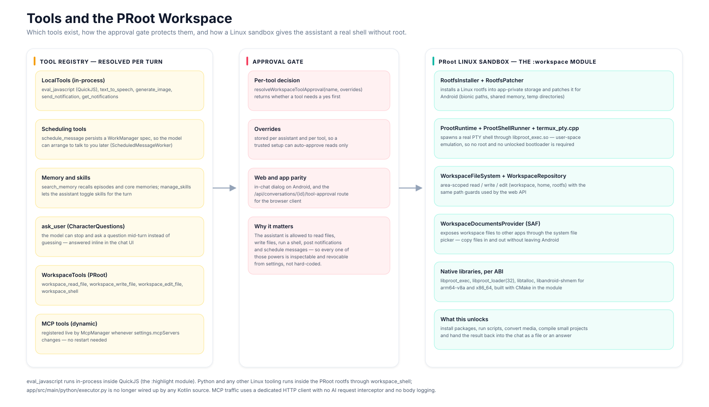
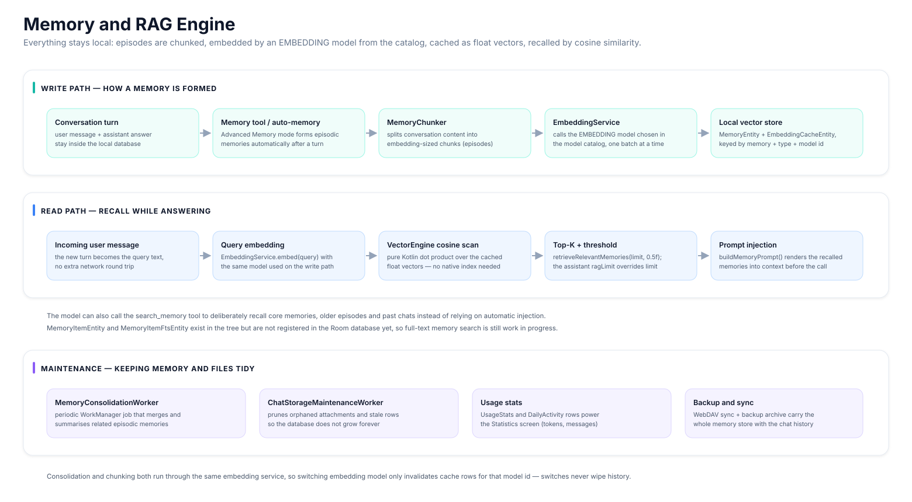
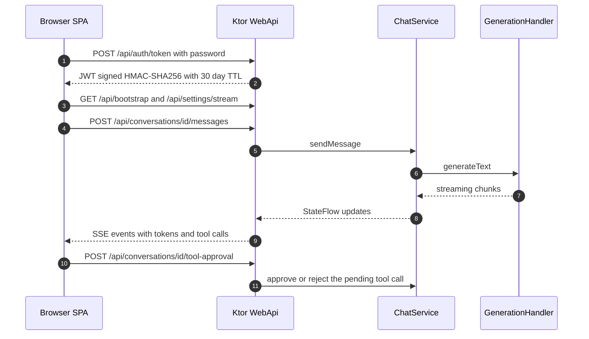

# Local AI

<p align="center">
  
</p>

<p align="center">
  <b>An open-source, on-device AI assistant for Android</b><br/>
  Material 3 Expressive UI · multi-provider model routing · local RAG memory · PRoot Linux tool sandbox · a web UI you open from any browser on your Wi-Fi.
</p>

<p align="center">
  <a href="https://github.com/smartworldarafath/Local-AI/stargazers"></a>
  <a href="LICENSE"></a>
  
  
  
</p>

**Local AI** is a feature-rich, high-performance open-source AI assistant application for Android built with Material 3 Expressive, flexible theme controls, resource management, and local multi-provider support.

It is not a thin chat client. Local AI is a complete, self-hosted AI workspace that lives inside one Android app: it talks to hosted or local model servers, remembers what matters in a local vector store, gives the model real tools (JavaScript, notifications, image generation, a Linux shell), and exposes itself over your LAN as a web app — with no account, no relay server and no telemetry.

---

## 📸 A quick look

<table>
  <tr>
    <td align="center" width="33%">
      <br/>
      <sub><b>Chat</b> — reasoning timer, tool badges, rendered SVG answer</sub>
    </td>
    <td align="center" width="33%">
      <br/>
      <sub><b>Memory</b> — memory modes, RAG retrieval, memory search tool</sub>
    </td>
    <td align="center" width="33%">
      <br/>
      <sub><b>Statistics</b> — activity heatmap, conversations, tokens</sub>
    </td>
  </tr>
</table>

More screenshots per release live in [`docs/`](docs), including provider setup walkthroughs (`1.1.6_providers_use.gif`, `1.3.4_providers_use.gif`).

---

## 📚 Table of contents

- [What you can actually do with it](#-what-you-can-actually-do-with-it)
- [Feature tour](#-feature-tour)
- [Architecture at a glance](#-architecture-at-a-glance)
- [Module graph](#-module-graph)
- [How a chat turn works](#-how-a-chat-turn-works)
- [Providers and the model catalog](#-providers-and-the-model-catalog)
- [Tools, MCP and the PRoot workspace](#-tools-mcp-and-the-proot-workspace)
- [Memory and the RAG engine](#-memory-and-the-rag-engine)
- [Remote access: the embedded web UI](#-remote-access-the-embedded-web-ui)
- [Background work, data and privacy](#-background-work-data-and-privacy)
- [Project layout](#-project-layout)
- [Build and run](#-build-and-run)
- [Tech stack](#-tech-stack)
- [Roadmap](#-roadmap)
- [Contributing](#-contributing)
- [License](#-license)

---

## 💡 What you can actually do with it

| I want to… | Local AI does it with… |
| :--- | :--- |
| Chat with GPT / Claude / Gemini / DeepSeek / OpenRouter / a local Ollama box | One assistant definition, per-assistant model choice, 62 provider presets in the bundled catalog, plus custom OpenAI-compatible endpoints |
| Keep long-term context without a cloud memory service | Local RAG memory: episodic chunks embedded by an embedding model you pick, stored on device, recalled by cosine similarity |
| Ask a model to actually *do* something on my phone | Built-in tools: `eval_javascript`, `text_to_speech`, `generate_image`, `send_notification`, `schedule_message`, `get_notifications`, `search_memory`, `manage_skills`, `ask_user` |
| Run Python, a package manager, `ffmpeg` or a build script on the phone | The `:workspace` module installs a PRoot Linux rootfs and exposes `workspace_shell`, `workspace_read_file`, `workspace_write_file`, `workspace_edit_file` — no root required |
| Use my own MCP servers | MCP client with custom SSE and Streamable-HTTP transports, hot-reloaded when the server list changes |
| Chat from my laptop while the phone does the work | Embedded Ktor server + React Router SPA + JWT auth + SSE streaming, advertised over mDNS on the LAN |
| Read a PDF / Word file / photo and ask about it | PDF (MuPDF), DOCX→Markdown, OCR transformer, image/video/audio attachments, vision models |
| Have a character remember a persona | Assistants, lorebooks (world info), skills, prompt injections, message branching, character-card import |
| Get a message from the assistant later | `schedule_message` + `ScheduledMessageWorker`; also spontaneous messaging and a home-screen widget |
| Back everything up | Backup archive export/import, WebDAV sync, Chatbox and Cherry Studio importers |

---

## ✨ Feature tour

### 🎨 Material 3 Expressive and full UI control

* **Material 3 Expressive** — expressive shapes, spring physics and fluid micro-animations on every screen, built on `androidx.compose.material3` with a dedicated motion policy layer (`ui/motion/MotionPolicy.kt`).
* **Theme system** — Android 12+ **dynamic color**, six hand-tuned built-in presets (`Seafoam Mint`, `Ocean`, `Sakura`, `Spring`, `Autumn`, `Black`), a **custom theme creator** that stores your own palettes, and a one-tap **Default** restore button.
* **Light slider** — a centre-default slider from `-1.0` to `+1.0` that smoothly shifts UI lightness and colour saturation without rewriting the palette.
* **CPU & GPU usage control** — a live hardware monitor plus CPU and GPU power-limit sliders (20 / 35 / 50 / 75 / 90 / System-Recommended presets) so long sessions do not cook the battery (`SettingDisplayPage.kt`, persisted as `cpuLimitPercentage` / `gpuLimitPercentage`).
* **Adaptive layout** — the settings scaffold switches between compact and wide mode at `width ≥ 840.dp && height ≥ 600.dp`, so tablets and foldables get a two-pane experience for free.
* **Premium haptics** — a 12-pattern haptic vocabulary (`rememberPremiumHaptics()`) instead of ad-hoc vibration calls.
* **7 locales** — English, Arabic (RTL, with a dedicated follow-up string set), Simplified Chinese, Traditional Chinese, Japanese, Korean and Russian, plus an `i18n/` Bun + Ink TUI that translates missing keys with AI.

---

### 🤖 Assistants that are more than a system prompt

* Each **assistant** carries its own avatar, system prompt, model, temperature, provider overrides, tool selection, built-in tool toggles, memory configuration, RAG limit, lorebooks, skills and context-management policy.
* **Message branching** — regenerate or edit any turn to create versions inside a `MessageNode`; switch between versions without losing the others.
* **Lorebook** (world-info injection) with per-entry activation rules, editable from settings.
* **Skills** — progressive capability packs the model can enable per turn through the `manage_skills` tool.
* **Prompt injections** and roleplay-optimisation toggles for character-driven chats.
* **Reasoning display** — `think` blocks are split out by `ThinkTagTransformer` and shown in a collapsible reasoning panel with elapsed time, next to per-message token and timing stats.
* **Statistics** — activity heatmap, conversation count, message count and token totals (`UsageStatsEntity`, `DailyActivityEntity`).
* **Import/export** — assistant importers, character cards, and importers for Chatbox and Cherry Studio provider exports.

### 🌍 Models and providers without lock-in

* **Four native provider implementations** in the `:ai` module: **OpenAI** (both `/chat/completions` and the newer `/responses` API, switchable per provider), **Google** (Gemini and Vertex AI with service-account JWT signing), **Anthropic Claude**, and **ComfyUI** for diffusion workflows.
* **62 provider presets and 54 model families** in the bundled catalog — OpenRouter, DeepSeek, Groq, SiliconFlow, AiHubMix, DashScope, Zhipu, Mistral, Ollama, LM Studio and many more — with per-model overrides resolved at runtime.
* **Custom OpenAI-compatible providers** for anything else, including self-hosted gateways.
* **Key roulette** — comma- or whitespace-separated API keys in one field, one picked at random per request for simple rotation.
* **Per-model routing** — a model can carry its own `ProviderSetting` (`providerOverwrite`), so the catalog can route a specific model id to the provider that actually serves it.
* **Host-aware request shaping** — reasoning flags are adapted per host (`reasoning_effort`, `enable_thinking` + `thinking_budget`, `thinking.type`, `thinking_mode`, …), OpenRouter and AiHubMix get their referer headers, and Qwen reasoning-off uses a `<think></think>` prefill trick.
* **Resilience** — providers retry HTTP 429 up to three times with linear backoff, and streaming read timeouts stay at 10 minutes so long generations survive.
* **Image generation** — ComfyUI and image-capable presets, driven from chat or the dedicated image-generation page.
* **Local models** — point a provider at Ollama or LM Studio and nothing leaves your machine.

### 📎 Multimodal input and document understanding

* Text, **images, video and audio** attachments in one composer.
* **Documents**: PDF parsing through MuPDF and DOCX→Markdown conversion through an XmlPullParser-based reader (`:document`), then handed to the model as prompt text.
* **OCR** through a vision model for screenshots and scans (`OcrTransformer` + `OcrPrompt`).
* **Attachments are content-addressed** — the attachment repository de-duplicates by SHA-256 and stores metadata (OCR text, dimensions, duration) alongside the file.
* **Voice in, voice out** — six ASR engines (OpenAI-compatible, OpenAI Realtime, DashScope, Volcengine, MiMo, Step) and nine TTS providers (OpenAI, Gemini, MiniMax, ElevenLabs, Qwen, Fish Audio, Cartesia, PlayHT, Android System) with Media3 playback and PCM/WAV handling.

---

### 🧰 Tools: the assistant can act, not just answer

| Tool | What it does |
| :--- | :--- |
| `eval_javascript` | Runs JavaScript in an **embedded QuickJS** engine (the same engine that powers PrismJS syntax highlighting) |
| `workspace_shell` | Executes shell commands inside the **PRoot Linux rootfs** — package managers, scripts, compilers, media tooling |
| `workspace_read_file` / `workspace_write_file` / `workspace_edit_file` | Area-scoped file access inside the workspace, home and rootfs with path guards |
| `text_to_speech` | Speaks the answer with any configured TTS provider |
| `generate_image` | Calls ComfyUI or an image-capable model and drops the result into the conversation |
| `send_notification` / `get_notifications` | Posts notifications and reads what other apps posted (`NotificationListenerService`) |
| `schedule_message` | Persists a WorkManager job so the assistant can message you later |
| `search_memory` | Deliberate recall from core memories, episodes and older chats |
| `manage_skills` | Enables skills for the current turn |
| `ask_user` | Asks a clarifying question mid-turn instead of guessing |
| **Web search** | 15 providers: Tavily, Exa, Zhipu, Bing, SearXNG, LinkUp, Brave, Metaso, Ollama, Perplexity, Firecrawl, Jina, Bocha, NanoGPT, Grok |
| **MCP** | Any Model Context Protocol server over SSE or Streamable HTTP, added and hot-reloaded from settings |

Every one of these is **gated by an approval map** — `resolveWorkspaceToolApproval(name, overrides)` decides per tool (and per assistant) whether the model may act silently or must ask first, and the same gate is exposed to the web UI through `POST /api/conversations/{id}/tool-approval`.

### 🌐 Remote access: the phone is the server

* An **embedded Ktor (CIO) server** starts from a foreground service (with a `WifiLock`), serving a compiled **React Router 7 SPA** straight out of the APK plus a REST + SSE API.
* **JWT HMAC-SHA256** tokens (30-day TTL, issuer `lastchat-web`) behind an optional password gate; the SPA is told whether auth is required through an injected `window.__LASTCHAT_WEB_BOOT__` bootstrap object.
* **mDNS/NSD** publishing (`_http._tcp.local.`) so the URL appears by name on the LAN.
* **Server-sent events** stream tokens, tool calls and settings changes to the browser in real time.
* Sessions are shared: the same assistants, conversations, model settings, memory and file store you have on the phone are what the browser talks to. Nothing is uploaded anywhere.

### ⏰ Automation and Android integration

* **Scheduled messages** (`ScheduledMessageWorker` + `ScheduledMessageReceiver`) and **spontaneous messaging** — the assistant can start a conversation on its own terms, with a dedicated `PERSIST_ON_REPLY` persistence mode so drafts never pollute history.
* **Home-screen widget** built with Glance, plus a widget-config activity.
* **Share sheet and text selection** — `ShareWithCharacterActivity`, `TextSelectionActivity`, `ShortcutHandlerActivity` and `AskLastChatShareActivity` are thin trampolines into the single Compose host, so "share to Local AI" and "ask about this text" work from any app.
* **App shortcuts** and launcher integrations via `AppShortcutManager`.
* **WebDAV sync** and **backup archives** for moving chats, assistants and memory between devices.

### 🔒 Privacy by design

* **No analytics.** Firebase is limited to Crashlytics and RemoteConfig; Analytics was deliberately removed.
* **API keys never live in settings.** They are written through `SecretKeyManager` into an `EncryptedSharedPreferences`-backed `SecureStore`, with one key namespace per provider / TTS / STT / WebDAV entry.
* **Data stays local** unless you choose a hosted provider: conversations, attachments, embeddings and memory are all in Room/DataStore inside the app sandbox.
* **Tool powers are opt-in and revocable**, and the web API is LAN-only with explicit auth.

---

## 🏗 Architecture at a glance



Six layers, one process:

| # | Layer | What lives there |
| :- | :--- | :--- |
| 1 | **Presentation (Compose)** | `RouteActivity` is the only Compose host — everything else is a thin trampoline activity. Type-safe Navigation 2 routes (`Screen` sealed interface), chat UI with streaming Markdown/LaTeX/table rendering, adaptive settings, theme engine, Glance widget |
| 2 | **State & lifecycle** | `ChatService` (Koin singleton) owns `Map<Uuid, MutableStateFlow<Conversation>>`, reference counts, one generation `Job` per conversation and the `ChatPersistenceMode` map. ViewModels expose `stateIn(WhileSubscribed(5000))`. WorkManager workers run consolidation, scheduling, spontaneous messaging and storage maintenance |
| 3 | **AI orchestration** | `GenerationHandler` builds the request (`buildMessages`), injects memory / lorebook / skills / time awareness, runs the up-to-256-step tool loop, and pipes chunks through the transformer pipeline |
| 4 | **Capability modules** | `:ai` (providers), `:search` (15 search providers), `:tts` (9), `:speech` (6), `:highlight` (QuickJS + PrismJS), `:document` (PDF/DOCX), `:workspace` (PRoot), plus the in-app MCP client |
| 5 | **Data** | Room v33 (conversations, messages, memories, embedding cache, attachments, usage stats), DataStore-backed `SettingsStore`, `SecureStore` for secrets, file stores, WebDAV/backup |
| 6 | **Platform** | `:shared` KMP contracts (`PlatformHttpClient`, `PlatformFileStore`, `PlatformJwtSigner`, `PlatformMediaEncoder`, `PlatformLog`, `SecureSettingsStore`, `PlatformHaptics`) and their Android adapters in `:common` |

The blue column on the right is the **embedded web tier**: a Ktor server inside the same process, bridging browser requests into `ChatService` with REST + SSE.

### Module graph



| Module | Type | Responsibility |
| :--- | :--- | :--- |
| `:app` | Android application | UI, ViewModels, Koin DI, Room, WorkManager, Ktor web server, AI orchestration, widgets, share, main `applicationId` |
| `:shared` | Kotlin Multiplatform (Android + iOS) | Platform contracts and pure AI types (`MessageRole`, `TokenUsage`, `ModelType`, `Modality`, model registry, utilities). Only module with iOS targets |
| `:common` | Android library | Android adapters for the `:shared` contracts (`OkHttpPlatformHttpClient`, `AndroidFileStore`, …), URL/JSON/HTML helpers, in-memory log ring buffer. Re-exports `:shared` via `api(project(":shared"))` |
| `:ai` | Android library | Provider abstraction: the `Provider` interface plus `OpenAIProvider` (Chat Completions + Responses), `GoogleProvider`, `ClaudeProvider`, `ComfyUIProvider`, `ProviderManager`, streaming merge helpers |
| `:search` | Android library | 15 web-search providers behind one `SearchService` interface |
| `:tts` | Android library | 9 text-to-speech providers, PCM/WAV helpers, Media3 playback |
| `:speech` | Android library | 6 speech-recognition / realtime-voice controllers |
| `:highlight` | Android library (Compose) | QuickJS + PrismJS syntax highlighting (single-threaded, ≤ 4096 chars per block) |
| `:document` | Android library | PDF (MuPDF) and DOCX→Markdown parsing |
| `:workspace` | Android library + CMake/NDK | PRoot runtime, rootfs installer/patcher, PTY shell, workspace file system |
| `:app:baselineprofile` | `com.android.test` | Baseline Profile generator for faster cold starts |
| `web-ui/` | React Router 7 SPA (npm, not Gradle) | Browser frontend, built by `:app`'s `buildWebUi` task into Android assets |

**Why this shape?** The capability modules have no dependency on the app, so they are testable in isolation (each ships unit tests) and are the declared candidates for the iOS portability effort — see [`docs/ios-portability.md`](docs/ios-portability.md) and the `./gradlew iosPortabilityReport` task.

---

## 🔄 How a chat turn works



**Stage by stage**

| Stage | Detail |
| :--- | :--- |
| **1 · Input** | Text, images, video, audio, PDF/DOCX documents, share-intent payloads, text selections, or uploads through the web API. The attachment manager de-duplicates by SHA-256 and records metadata |
| **2 · Input transformers** | `TemplateTransformer` (Pebble), `PlaceholderTransformer`, `OcrTransformer`, `DocumentAsPromptTransformer`, `Base64ImageToLocalFileTransformer`, `UnsupportedFileTransformer`, `WorkspaceReminderTransformer` — each can rewrite or expand a message before it reaches the model |
| **3 · Context assembly** | `buildMessages()` composes the system prompt, lorebook entries, skills, time awareness, recalled RAG memories and recent-chat references. `limitContext(n)` trims history *without breaking tool-call → tool-result chains* |
| **4 · Provider request** | `ProviderManager` resolves the provider (honouring per-model `providerOverwrite`), the key comes from key roulette, and the request is shaped for that host's reasoning API |
| **5 · Streaming + tools** | SSE deltas are merged with `handleMessageChunk(...)`, the partial answer is checkpointed to Room every second, and any tool call restarts the loop with the tool result appended — up to 256 steps |
| **6 · Output + storage** | `ThinkTagTransformer` splits reasoning from the answer, `RegexOutputTransformer` applies rewrites, the `visualTransform` hook drives the live view, `onGenerationFinish` runs post-processing, and the turn is persisted as a branchable `MessageNode` with usage stats |



**Reliability contracts**

* One cancelable `Job` per conversation lives in `ChatService`; pressing stop aborts the SSE stream and keeps whatever already arrived.
* Partial answers are written to Room every second (`STREAMING_CHECKPOINT_INTERVAL_MS = 1000`), with automatic resume up to three times (`700 ms` apart) if a generation is interrupted.
* Three persistence modes: `NORMAL`, `TEMPORARY` (nothing is stored) and `PERSIST_ON_REPLY`, used by spontaneous messages so drafts stay out of history.

---

## 🔌 Providers and the model catalog

### The provider abstraction

`Provider<T : ProviderSetting>` is an **interface** in `:ai`. A provider declares the models it supports and exposes one streaming call that returns `Flow<GenerationChunk>`. `ProviderManager` registers the built-ins in its `init {}` block, resolves the right implementation per `ProviderSetting` type, and hands the provider the platform's `PlatformHttpClient` — never OkHttp directly, which is what keeps the module iOS-portable.

Implementation notes worth knowing:

* **OpenAI is split in two code paths** — `ChatCompletionsAPI` (ends on `[DONE]`) and `ResponseAPI` (ends on `response.completed`), toggled per provider with `useResponseApi`.
* **Vertex AI** mints an RS256 JWT through `PlatformJwtSigner` with a cached token (5-minute pre-expiry buffer) instead of shipping a service-account library.
* **Streaming** is built on `PlatformHttpClient.streamEvents()` — a sealed `PlatformServerEvent` (`Open`, `Event`, `Closed`, `Failure`), so the same SSE parser works on Android and, later, on iOS.
* **ComfyUI** models are normalised by `Model.withComfyDefaults()` (extension and modality forced), so a hand-written model entry cannot break the workflow.
* **SiliconFlow free models** get authentication overridden per Firebase RemoteConfig, with the decision delegated to a shared policy class.

### The catalog

The app ships [`catalog/lastchat_catalog.json`](catalog/lastchat_catalog.json) (with 110+ provider icons in `catalog/icons/`) and merges it into your settings at runtime:

* **62 provider presets** — base URL, chat path, response-API flag, balance option, icon, signup/API-key links, setup hints and defaults.
* **54 model families** with version entries, icons, context lengths, modality and capability flags.
* **15 search providers**, **5 TTS providers** and **16 STT providers** described declaratively, so the UI can list them without hard-coding.
* **`model_overrides`** for exceptions and **`global_rules`** for cross-cutting rules.



Resolution order is `global_rules → model_families → model_families[].versions → model_overrides`; each layer overrides the previous one, and metadata is only applied when at least one rule actually matched. `ModelCatalogService` can refresh the catalog, `mergeCatalogIntoSettings` folds it into the settings snapshot, and `ModelMetadataResolver` answers "which icon, which modalities, which tools does this model id support?".

Model types are explicit: `CHAT` (text in/out), `EMBEDDING` (text in/out, used by the RAG engine), `IMAGE` (text in, image out) and `STT` (audio in, text out).

### Adding your own provider

1. Add a `ProviderSetting` subtype (`@SerialName`) with the four model mutators and `copyProvider(...)`.
2. Implement `Provider<ProviderSetting.YourProvider>` in `:ai/provider/providers/`, reusing the `PlatformHttpClient` + `retryWhen { 429 }` streaming pattern.
3. Register it in `ProviderManager` and add the `when` branch in `getProviderByType`.
4. Add a `SecretKeyManager` branch so the API key is stored encrypted.
5. Wire the UI in `ui/pages/setting/components/` and, optionally, a default preset in `DefaultProviders.kt`.

The catalog authoring skill (`.agents/skills/lastchat-catalog/SKILL.md`) documents the JSON contract, and `tools/catalog_editor/catalog_editor.py` is a small Tkinter editor for it.

---

## 🧰 Tools, MCP and the PRoot workspace



The tool list for a turn is assembled by `BuiltInToolResolution` from four sources:

1. **`LocalTools`** — in-process tools: `eval_javascript` (QuickJS), `text_to_speech`, `generate_image`, `send_notification`, `schedule_message`, `get_notifications`.
2. **Memory and skills** — `search_memory` and `manage_skills`.
3. **`WorkspaceTools`** — `workspace_read_file`, `workspace_write_file`, `workspace_edit_file`, `workspace_shell`, backed by `WorkspaceRepository`.
4. **MCP tools** — pulled from every configured server by `McpManager`.

### Inside the Linux sandbox

The `:workspace` module is what makes "run it on the phone" real:

* **`RootfsInstaller` / `RootfsPatcher`** download and patch a Linux rootfs into app-private storage so Android's bionic quirks (shared memory, temp paths) are handled.
* **`ProotRuntime` + `ProotShellRunner` + `termux_pty.cpp`** spawn a genuine PTY shell through `libproot_exec.so`. PRoot is user-space emulation, so **no root and no unlocked bootloader** are needed.
* **`WorkspaceFileSystem`** scopes reads and writes to declared areas (workspace, home, rootfs) with the same path guards the web API uses.
* **`WorkspaceDocumentsProvider`** exposes the workspace through Android's Storage Access Framework, so any file manager can copy files in and out.
* Native pieces ship per ABI (`arm64-v8a`, `x86_64`): `libproot_exec`, `libproot_loader` / `libproot_loader32`, `libtalloc`, `libandroid-shmem`, built with CMake.
* The terminal has its own UI (`WorkspaceTerminalPage`) for driving the sandbox by hand.

Two engines, two jobs: **QuickJS runs JavaScript in-process** (also powering syntax highlighting), while **anything Linux runs inside the PRoot rootfs** and is reached through `workspace_shell`.

### MCP

`McpManager` reactively syncs clients whenever `settings.mcpServers` changes — no restart. Transports are custom implementations (`SseClientTransport`, `StreamableHttpClientTransport`) built on `PlatformHttpClient`, and MCP traffic uses a dedicated HTTP client with no AI request interceptor and no body logging, so tool payloads stay out of the request log.

---

## 🧠 Memory and the RAG engine



**Write path.** When memory is enabled (and in *Advanced* mode, automatically), conversation content is chunked by `MemoryChunker`, embedded by `EmbeddingService` using the `EMBEDDING` model you selected, and stored in Room as `MemoryEntity` plus an `EmbeddingCacheEntity` row keyed by `memory_id + memory_type + model_id`.

**Read path.** The incoming message becomes the query, gets embedded with the same model, and `VectorEngine` scans the cached float vectors with a plain cosine-similarity dot product — no native vector index, no external service. The top-K results above a `0.5` similarity threshold are rendered by `buildMemoryPrompt()` into the context block before the provider call. Defaults are `limit = 5`, and each assistant can override the limit (`ragLimit`).

**Deliberate recall.** The model can also call the `search_memory` tool to look back at core memories, episodes and older chats on demand — useful when automatic retrieval is not enough.

**Maintenance.** `MemoryConsolidationWorker` periodically merges and summarises related episodes, while `ChatStorageMaintenanceWorker` prunes orphaned attachments and stale rows. Cache rows survive embedding-model switches because they are namespaced per model id.

> **Work in progress:** `MemoryItemEntity` and `MemoryItemFtsEntity` exist in the source tree but are not registered in the Room database yet, so full-text memory search is still landing.

---

## 🌐 Remote access: the embedded web UI

Local AI contains a complete web frontend (`web-ui/`, React Router 7 + Tailwind v4 + Radix + zustand + shiki + KaTeX) that is compiled at build time and served by an **embedded Ktor CIO server** running inside the app. Start it from Settings → Web, open the printed URL (or the mDNS name `_http._tcp.local.`) on any device on the same Wi-Fi, and you are chatting with the same assistants, models, memory and history.



**Selected API surface**

| Route | Purpose |
| :--- | :--- |
| `POST /api/auth/token` | Exchange the optional password for a JWT |
| `GET /api/bootstrap`, `GET /api/ai-icon` | SPA bootstrap data and icon assets |
| `GET /api/conversations/paged`, `/search` | Conversation list with paging3 support and search |
| `GET /api/conversations/{id}`, `GET /{id}/stream` | Conversation snapshot and live SSE stream |
| `POST /api/conversations/{id}/messages` | Send a message from the browser |
| `POST /{id}/messages/{messageId}/edit`, `DELETE ...` | Edit or delete a message |
| `POST /{id}/regenerate`, `/{id}/stop` | Regenerate or abort a generation |
| `POST /{id}/nodes/{nodeId}/select` | Switch message branch version |
| `POST /{id}/tool-approval` | Answer a pending tool-approval request |
| `POST /{id}/fork`, `/{id}/move`, `/{id}/skills`, `/{id}/consolidate`, `/{id}/context-refresh`, `/{id}/regenerate-title`, `/{id}/title`, `/{id}/pin` | Conversation management |
| `POST /api/settings/*`, `GET /api/settings/stream` | Assistant, model, thinking budget, MCP, injections, search, built-in tools, favourites — with a live settings stream |
| `POST /api/files/upload`, `GET /api/files/content`, `GET /api/files/path/{path...}`, `DELETE /api/files/{id}` | Attachment upload, `file://` / `content://` / `android.resource://` resolution and workspace path access |

`WebDtos.kt` maps `Settings`, `Conversation`, `UIMessage` and `Assistant` to DTOs, and `WebMedia.kt` rewrites device-local URIs into `/api/files/content?uri=...` so the browser can render media that lives on the phone.

---

## ⚙ Background work, data and privacy

### WorkManager jobs

| Worker | Job |
| :--- | :--- |
| `MemoryConsolidationWorker` | Merges and summarises episodic memories |
| `ScheduledMessageWorker` + `ScheduledMessageReceiver` | Delivers messages the assistant scheduled with `schedule_message` |
| `SpontaneousWorker` + `SpontaneousMessaging` | Lets the assistant open a conversation on its own |
| `ChatStorageMaintenanceWorker` | Prunes orphaned attachments and stale rows |

Koin's `workManagerFactory()` is installed so every worker can `inject(...)`; the default WorkManager initialiser is removed in the manifest.

### Data layer

| Store | Contents |
| :--- | :--- |
| **Room v33** | Conversations, message nodes, memories, embedding cache, attachments, conversation-attachment refs, generated media, usage stats, daily activity, workspace entries. 33 committed schema snapshots (including auto-migrations) so upgrades are testable |
| **DataStore (`SettingsStore`)** | The settings snapshot, with a `SettingsStore.update { … }` API that normalises, migrates secrets and updates in-memory state in one place |
| **`SecureStore`** | `EncryptedSharedPreferences` via `SecretKeyManager` — provider, TTS, STT and WebDAV credentials |
| **Files** | Content-addressed attachments, generated media, workspace/rootfs trees, exported backups |

Room is opened with a 16 MB cursor window and `PRAGMA busy_timeout = 5000`, because long conversations and paged lists can be large.

### Privacy summary

* Crashlytics + RemoteConfig only — **Firebase Analytics was intentionally removed** and should not come back.
* Secrets never touch plain settings; they are encrypted at rest.
* The web server binds to your LAN, requires a JWT for anything past `/api/bootstrap`, and streams only what already exists on the device.
* You can run everything against local models (Ollama / LM Studio / a LAN gateway) and keep every byte on-device.

---

## 📁 Project layout

```text
Local-AI/
├── app/                          # :app — the Android application
│   ├── schemas/                  # Room schema snapshots 1..33 (committed, used by migration tests)
│   └── src/main/java/me/rerere/rikkahub/
│       ├── data/ai/              # GenerationHandler, transformers, tools, rag, mcp, model catalog
│       ├── data/db/              # Room entities, DAOs, type converters
│       ├── data/datastore/       # SettingsStore, SecureStore, SecretKeyManager, default providers
│       ├── data/repository/      # conversation, attachment, memory, media, workspace repositories
│       ├── data/sync/            # WebDAV sync, backup archive, Chatbox / Cherry Studio importers
│       ├── di/                   # AppModule, DataSourceModule, RepositoryModule, ViewModelModule
│       ├── service/              # ChatService, WorkManager workers, WebServerService, notification listener
│       ├── ui/                   # theme, components, pages, motion, hooks, widgets, share
│       └── web/                  # Ktor server: Entry, WebApi, WebDtos, WebMedia, NSD/mDNS
├── ai/                           # provider abstraction + OpenAI / Google / Claude / ComfyUI
├── common/                       # Android adapters for the :shared contracts
├── shared/                       # KMP contracts + pure AI types (Android + iOS targets)
├── search/  tts/  speech/        # 15 search providers, 9 TTS providers, 6 ASR engines
├── highlight/  document/         # QuickJS + PrismJS highlighting, PDF and DOCX parsing
├── workspace/                    # PRoot sandbox (src/main/cpp with CMake, jniLibs per ABI)
├── web-ui/                       # React Router 7 SPA compiled into the APK
├── catalog/                      # lastchat_catalog.json + provider icons
├── assets/architecture/          # the architecture diagrams used in this README
├── docs/                         # screenshots per release, icons, ios-portability.md
├── i18n/                         # Bun + Ink TUI that translates missing strings with AI
├── tools/catalog_editor/         # Tkinter editor for the model catalog
├── .agents/skills/               # agent skills (catalog authoring, and more)
├── AGENTS.md                     # the codebase handbook — read this before contributing
├── settings.gradle.kts           # module list
└── gradle/libs.versions.toml     # the single source of truth for dependency versions
```

---

## 🚀 Build and run

**Requirements**

* **JDK 17** and Android SDK with **compileSdk 36** / build-tools for API 36
* **Node.js + npm** — required, not optional: `:app:preBuild` depends on `buildWebUi`, which runs `npm run build` inside `web-ui/`
* Optional: `google-services.json` in `app/` for release builds (Crashlytics + RemoteConfig). The plugin no-ops when the file is missing

**Debug build**

```bash
git clone https://github.com/smartworldarafath/Local-AI.git
cd Local-AI
./gradlew :app:assembleDebug        # Windows: gradlew.bat :app:assembleDebug
```

The APK lands in `app/build/outputs/apk/` as `LocalAI_<versionName>_<variant>.apk` (see `app/build.gradle.kts`, currently `versionName 1.2` / `versionCode 34`).

**Release build**

1. Put signing details in `local.properties`: `storeFile`, `storePassword`, `keyAlias`, `keyPassword`. If they are absent, release falls back to debug signing.
2. Run `./gradlew :app:buildAll` to get both `assembleRelease` and `bundleRelease`.
3. R8 minification is on by default; disable it with `-Plastchat.release.minify=false`.

**Handy tasks**

| Task | What it does |
| :--- | :--- |
| `./gradlew test` | Unit tests across all modules |
| `./gradlew iosPortabilityReport` | Non-failing report of Android/JVM-only imports in shared-candidate packages |
| `./gradlew :app:generateReleaseBaselineProfile` | Regenerates `app/src/release/baseline-prof.txt` |
| `python tools/catalog_editor/catalog_editor.py` | GUI editor for `catalog/lastchat_catalog.json` |

**Continuous integration** — `.github/workflows/build.yaml` builds on every push and pull request to `main` (JDK 17 + the web UI build step), and `.github/workflows/release.yml` is a manual `workflow_dispatch` job that produces a release APK. There is no AAB and no Play Store upload.

---

## 🧱 Tech stack

| Area | Choices |
| :--- | :--- |
| **Language & toolchain** | Kotlin 2.2.21, JVM target 17, Android Gradle Plugin 8.13.0, KSP 2.2.21-2.0.4, Gradle Kotlin DSL, version catalogue in `gradle/libs.versions.toml` |
| **UI** | Jetpack Compose (BOM 2025.11.00), Material 3 Expressive, Navigation Compose 2.9.6, Coil 3.3, Media3 1.8, Glance 1.1 widgets, custom motion policy |
| **DI** | Koin 4.1.1 (`AppModule`, `DataSourceModule`, `RepositoryModule`, `ViewModelModule`) |
| **Persistence** | Room 2.8.3 (KSP, 33 committed schemas), DataStore 1.1.7, `EncryptedSharedPreferences` via `secure-crypto` |
| **Concurrency** | Coroutines 1.10.2 + Flow, WorkManager 2.11 with Koin's worker factory, Paging 3.3.6 |
| **Networking** | OkHttp 5.1 behind the `PlatformHttpClient` contract, Ktor 3.3.2 (CIO) as the embedded server, custom SSE parsing |
| **Serialization** | kotlinx.serialization 1.9.0 with project-specific `JsonInstant` configurations |
| **Native / embedded engines** | QuickJS 3.2.3 (JavaScript + highlighting), PrismJS, MuPDF (PDF), PRoot + termux PTY via NDK/CMake |
| **Web UI** | React 19, React Router 7.13, Vite 7, Tailwind CSS 4, Radix UI, zustand 5, TanStack Query 5, shiki, KaTeX, i18next, streamdown |
| **Observability** | Firebase Crashlytics + RemoteConfig only (no Analytics), in-app log ring buffer, developer screen |
| **Performance** | Baseline Profiles (`:app:baselineprofile`), R8 minification, 16 MB Room cursor window, `deriveStateOf`-based recomposition discipline |

---

## 🗺 Roadmap

* **iOS portability** — the `:shared` contracts (`PlatformHttpClient`, `PlatformFileStore`, `PlatformJwtSigner`, `PlatformMediaEncoder`, `PlatformLog`, `SecureSettingsStore`, `PlatformHaptics`) already have Android adapters, and `./gradlew iosPortabilityReport` tracks the remaining Android-only imports in the candidate packages. See [`docs/ios-portability.md`](docs/ios-portability.md).
* **Full-text memory search** — registering `MemoryItemEntity` / `MemoryItemFtsEntity` in the Room database so memory can be searched lexically as well as by vector similarity.
* **Catalog growth** — more provider presets and model families; the catalog format is versioned and the authoring workflow is documented in `.agents/skills/lastchat-catalog/SKILL.md`.
* **Translations** — additional locales can be generated with the `i18n/` TUI; contributions are welcome but new languages are added deliberately.

---

## 🤝 Contributing

1. Read [`AGENTS.md`](AGENTS.md) — it is the authoritative handbook for this codebase (module boundaries, DI rules, migration rules, the streaming and streaming-merge contracts, and a long list of "do not do this" items that exist for real reasons).
2. Use **Conventional Commits** (`feat:`, `fix:`, `chore:`, `docs:`, …).
3. Match the existing style: `.editorconfig` enforces 4-space indentation for Kotlin, 2-space for XML/JSON/Markdown, a 120-column limit and UTF-8.
4. Keep platform-agnostic code platform-agnostic — use `PlatformHttpClient`, `PlatformLog`, `kotlin.io.encoding.Base64` and Kotlin atomics instead of their Android/JVM equivalents, and run `./gradlew iosPortabilityReport` after touching `:ai`, `:common` or `:shared`.
5. If you add screens or ViewModels, register them (`composable<Screen.X>` in `AppRoutes`, `viewModel<X> { … }` in `ViewModelModule`), and if you add a Room migration, register it in `dataSourceModule.addMigrations(...)` **and** commit the generated schema.
6. Run `./gradlew test` before opening a pull request. Issues and PRs are welcome at [github.com/smartworldarafath/Local-AI](https://github.com/smartworldarafath/Local-AI).

---

## 📜 License

**Local AI** is released under the **GNU Affero General Public License v3.0** — see [`LICENSE`](LICENSE) for the full text. If you run a modified version as a network service, the AGPL requires you to offer the corresponding source.

* **Repository**: [smartworldarafath/Local-AI](https://github.com/smartworldarafath/Local-AI)
* **Architecture diagrams**: [`assets/architecture/`](assets/architecture) (SVG, hand-maintained — open an issue if the code and the pictures ever disagree)

---

## ☕ Support / Buy Me a Coffee & Become a Sponsor

If you find **Local AI** helpful and want to support ongoing development, maintenance, and new features, consider contributing through any of the options below! Your support means the world and helps keep this project open-source.

<div align="center">

<table>
  <tr>
    <td align="center" width="25%" valign="top">
      <h4>☕ SupportKori</h4>
      <a href="https://www.supportkori.com/arafathrahman" target="_blank">
        
      </a><br/><br/>
      <a href="https://www.supportkori.com/arafathrahman" target="_blank">
        
      </a><br/>
      <sub>Cards / bKash / Nagad / Global</sub>
    </td>
    <td align="center" width="25%" valign="top">
      <h4>⚡ nsave</h4>
      <br/><br/>
      <br/>
      <sub>Ntag: <code>@arafath_rahman9</code></sub>
    </td>
    <td align="center" width="25%" valign="top">
      <h4>🔴 RedotPay</h4>
      <br/><br/>
      <br/>
      <sub>ID: <code>1965421414</code></sub>
    </td>
    <td align="center" width="25%" valign="top">
      <h4>🅿️ Payoneer</h4>
      <br/><br/>
      <a href="mailto:arafathrahman710@gmail.com?subject=Support%20via%20Payoneer">
        
      </a><br/>
      <sub>Email: <code>arafathrahman710@gmail.com</code></sub>
    </td>
  </tr>
</table>

<br/>

| Method | Details / Direct Link |
| :--- | :--- |
| **☕ SupportKori** | [https://www.supportkori.com/arafathrahman](https://www.supportkori.com/arafathrahman) |
| **⚡ nsave** | Ntag: `@arafath_rahman9` • `Md Arafath Rahman` |
| **🔴 RedotPay** | Account ID: `1965421414` |
| **🅿️ Payoneer** | Email: `arafathrahman710@gmail.com` • Customer ID: `70366820` |

</div>

